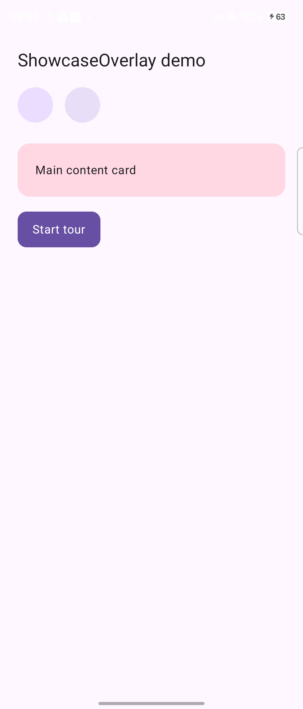
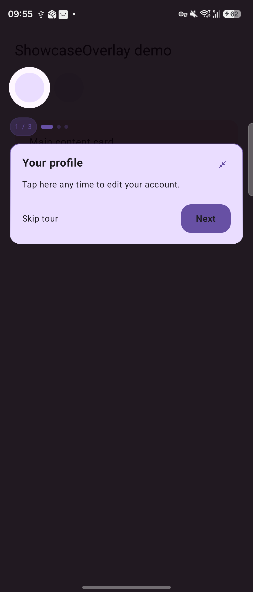
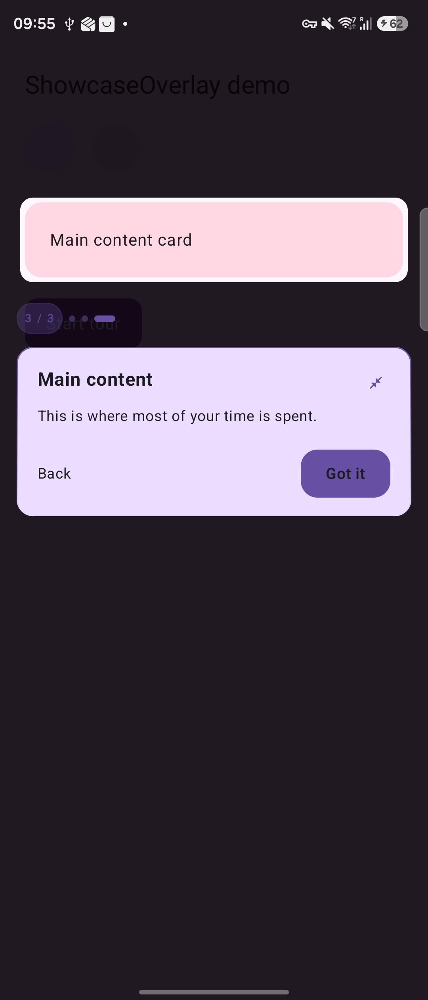

# ShowcaseOverlay

[](https://central.sonatype.com/artifact/io.github.astrit-veliu/showcaseoverlay)
[](https://github.com/astrit-veliu/ShowcaseOverlay/actions/workflows/build.yml)
[](https://android-arsenal.com/api?level=24)
[](LICENSE)
[](https://astrit-veliu.github.io/ShowcaseOverlay/)

A Jetpack Compose library for spotlight-style app showcases and feature tours. A cutout highlights one composable at a time, a tooltip explains it, and the sequence advances step by step, driven entirely by Compose state with no dependencies beyond Compose itself.

## Preview

<p align="center">
  
  
  
</p>

## Installation

```kotlin
dependencies {
    implementation("io.github.astrit-veliu:showcaseoverlay:1.0.0")
}
```

`mavenCentral()` needs to be in your `settings.gradle.kts` `dependencyResolutionManagement` block, which is Android Studio's default for new projects.

## Quick start

```kotlin
import io.github.astritveliu.showcaseoverlay.ui.composable.ShowcaseScaffold
import io.github.astritveliu.showcaseoverlay.ui.state.rememberShowcaseState
import io.github.astritveliu.showcaseoverlay.utils.showcaseTarget

@Composable
fun MyScreen() {
    val showcase = rememberShowcaseState(onFinished = { prefs.markSeen() })

    ShowcaseScaffold(states = arrayOf(showcase)) {
        Column {
            Icon(
                imageVector = Icons.Default.Person,
                contentDescription = "Profile",
                modifier = Modifier.showcaseTarget(
                    state = showcase,
                    index = 0,
                    title = "Your profile",
                    description = "Tap here any time to edit your account.",
                )
            )

            Button(onClick = { showcase.start() }) {
                Text("Start tour")
            }
        }
    }
}
```

That's the whole shape of it: wrap your screen in `ShowcaseScaffold`, tag whichever composables should be part of the tour with `.showcaseTarget(...)`, and call `start()` whenever the tour should begin.

## How it works

- `ShowcaseState` is the sequence's source of truth: which step is active, whether the overlay is visible, and callbacks for step changes and completion. Create one with `rememberShowcaseState`.
- `Modifier.showcaseTarget` registers a composable's on-screen position with a `ShowcaseState`, under a given step `index`. It reads layout coordinates only, so it never triggers recomposition on its own.
- `ShowcaseScaffold` wraps your screen content and renders a `ShowcaseOverlay` for each `ShowcaseState` passed to it, always drawn on top.
- The overlay draws a spotlight cutout around the current step's registered bounds and a tooltip with title, description, and Back / Skip / Next controls, animating smoothly between steps as the user or your code advances the sequence.

## API reference

### `rememberShowcaseState`

```kotlin
fun rememberShowcaseState(
    autoStartAfter: Int? = null,
    onStepChanged: ((step: Int, target: ShowcaseTarget) -> Unit)? = null,
    onFinished: (() -> Unit)? = null,
): ShowcaseState
```

| Parameter | Description |
|---|---|
| `autoStartAfter` | If set, the tour starts automatically once this many targets have registered with valid, on-screen bounds. Leave `null` to start manually via `.start()`. |
| `onStepChanged` | Called on every step change with the new zero-based index and its `ShowcaseTarget`. |
| `onFinished` | Called once when the tour is dismissed, whether by finishing the last step, the user tapping "Skip", or a programmatic `.dismiss()`. |

### `ShowcaseState`

| Member | Description |
|---|---|
| `isVisible: Boolean` | Whether the overlay is currently showing. |
| `currentIndex: Int` | The active step's zero-based index. |
| `currentTarget: ShowcaseTarget?` | The currently active target, if any. |
| `totalTargets: Int` | How many targets are registered. |
| `start()` | Begins the tour from step 0. No-op if no targets are registered yet, or if any registered target's bounds aren't measured yet. Safe to call repeatedly; it won't restart a tour already in progress. |
| `next()` | Advances to the next step, or finishes the tour if already on the last one. |
| `previous()` | Goes back one step. No-op on step 0. |
| `dismiss()` | Ends the tour immediately, firing `onFinished`. |
| `reset()` | Clears visibility and step position without clearing registered targets, so the same state can be restarted later (e.g. after an app update reintroduces the tour). |

### `Modifier.showcaseTarget`

```kotlin
fun Modifier.showcaseTarget(
    state: ShowcaseState,
    index: Int,
    title: String,
    description: String,
    shape: TargetShape = TargetShape.Circle,
    padding: Float = 24f,
    scaleFactor: Float = 1f,
    translationY: Float = 0f,
): Modifier
```

| Parameter | Description |
|---|---|
| `state` | The `ShowcaseState` this target belongs to. |
| `index` | This step's position in the sequence. Must be unique within `state`. |
| `title` | Headline shown in the tooltip. |
| `description` | Body text shown below the title. |
| `shape` | `TargetShape.Circle` or `TargetShape.RoundedRect`. |
| `padding` | Extra space, in pixels, around the target's bounds before drawing the cutout. |
| `scaleFactor` | Multiplies the cutout's size independently of the composable's actual layout size. `1f` is natural size; use smaller or larger values to spotlight something other than the exact bounds of the tagged composable, e.g. an icon inside a larger touch target. |
| `translationY` | Extra vertical offset in pixels, for a target that's already being animated or translated independently of normal layout (a collapsing toolbar, an animated reveal). |

### `ShowcaseScaffold`

```kotlin
@Composable
fun ShowcaseScaffold(
    modifier: Modifier = Modifier,
    vararg states: ShowcaseState,
    style: ShowcaseStyle = ShowcaseStyle(),
    content: @Composable () -> Unit,
)
```

Wraps `content` and renders one overlay per `ShowcaseState` passed via `states`, always on top of everything else. Accepts more than one state, for screens with multiple independent tours.

### `ShowcaseStyle`

```kotlin
data class ShowcaseStyle(
    val accentColor: Color = Color(0xFFE53935),
    val scrimColor: Color = Color(0xE5080008),
    val cardColor: Color = Color(0xFFFFFFFF),
    val cornerRadius: Dp = 16.dp,
    val closeIcon: ImageVector? = null,
)
```

A plain value object, not a `CompositionLocal` — pass it explicitly to `ShowcaseScaffold` or `ShowcaseOverlay`.

| Property | Description |
|---|---|
| `accentColor` | Used for the glow ring around the cutout, the step progress dots, and the primary action button. |
| `scrimColor` | The dimmed background color drawn behind the cutout. |
| `cardColor` | Background color of the tooltip card. |
| `cornerRadius` | Corner radius for the tooltip card and for `TargetShape.RoundedRect` cutouts. |
| `closeIcon` | Optional custom icon for the tooltip's dismiss control, in place of the library's default. |

### `TargetShape`

```kotlin
enum class TargetShape { Circle, RoundedRect }
```

## Styling

Define an app-wide default and reuse it wherever you build a showcase:

```kotlin
val AppShowcaseStyle = ShowcaseStyle(
    accentColor = MyTheme.colors.primary,
    cardColor = MyTheme.colors.surface,
    cornerRadius = 12.dp,
)

ShowcaseScaffold(states = arrayOf(showcase), style = AppShowcaseStyle) {
    /* ... */
}
```

## Multiple showcases in one screen

`ShowcaseScaffold` accepts any number of `ShowcaseState` instances, and each runs independently with its own targets, step order, and `onFinished`. A `ShowcaseState` can also be passed down into child composables so one tour spans multiple files:

```kotlin
@Composable
fun MyScreen() {
    val mainTour = rememberShowcaseState(autoStartAfter = 0)
    val advancedTour = rememberShowcaseState()

    ShowcaseScaffold(states = arrayOf(mainTour, advancedTour)) {
        Column {
            TopBar(
                modifier = Modifier.showcaseTarget(
                    state = mainTour,
                    index = 0,
                    title = "Menu",
                    description = "Everything lives behind this handle.",
                    scaleFactor = 0.2f,
                )
            )

            Button(onClick = { advancedTour.start() }) {
                Text("Show advanced options tour")
            }

            AdvancedToggle(
                modifier = Modifier.showcaseTarget(
                    state = advancedTour,
                    index = 0,
                    title = "Notifications",
                    description = "Configure reminders here.",
                )
            )
        }
    }
}
```

## Sequencing a tour ahead of other one-time UI

A common pattern: a first-time user should see a feature tour before an onboarding dialog or similar one-time prompt, regardless of load order. Track a local flag that starts unresolved, and gate the other UI on it:

```kotlin
val hasSeenTour by viewModel.hasSeenTour.collectAsStateWithLifecycle()
val needsOnboarding by viewModel.needsOnboarding.collectAsStateWithLifecycle()

var tourCompleted by remember { mutableStateOf<Boolean?>(null) }

LaunchedEffect(hasSeenTour) {
    if (hasSeenTour == false) tourCompleted = true
}

val showcase = rememberShowcaseState(
    onFinished = {
        viewModel.setHasSeenTour(true)
        tourCompleted = true
    }
)

LaunchedEffect(hasSeenTour) {
    if (hasSeenTour == true) showcase.start()
}

ShowcaseScaffold(states = arrayOf(showcase)) {
    MyScreenContent(/* ..., with showcaseTarget(...) modifiers as usual ... */)
}

if (tourCompleted == true && needsOnboarding == true) {
    FirstRunDialog(onConfirm = viewModel::completeOnboarding)
}
```

`tourCompleted` stays `null` for as long as the tour should be running, so the onboarding UI cannot appear until either the tour finishes or a persisted flag already says the user has seen it.

## Sample

The `app` module is a minimal runnable demo. Open this repository in Android Studio and run the `app` configuration.

## Documentation

Full API reference: <https://astrit-veliu.github.io/ShowcaseOverlay/>

## License

```
Copyright 2026 Astrit Veliu

Licensed under the Apache License, Version 2.0 (the "License");
you may not use this file except in compliance with the License.
You may obtain a copy of the License at

    http://www.apache.org/licenses/LICENSE-2.0

Unless required by applicable law or agreed to in writing, software
distributed under the License is distributed on an "AS IS" BASIS,
WITHOUT WARRANTIES OR CONDITIONS OF ANY KIND, either express or implied.
See the License for the specific language governing permissions and
limitations under the License.
```
